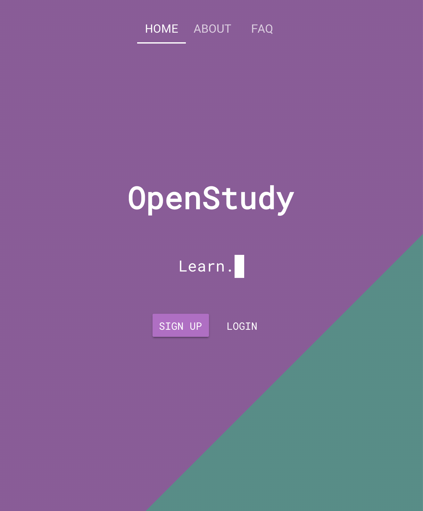
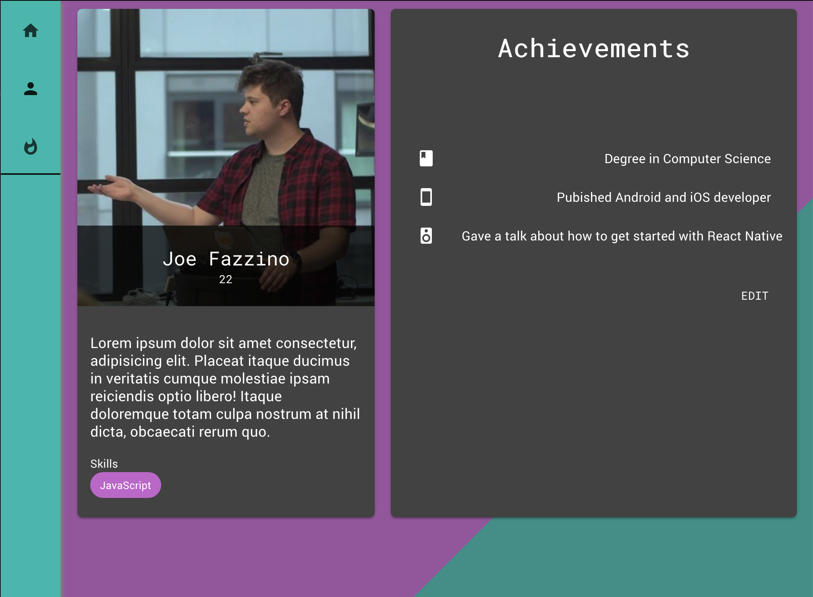
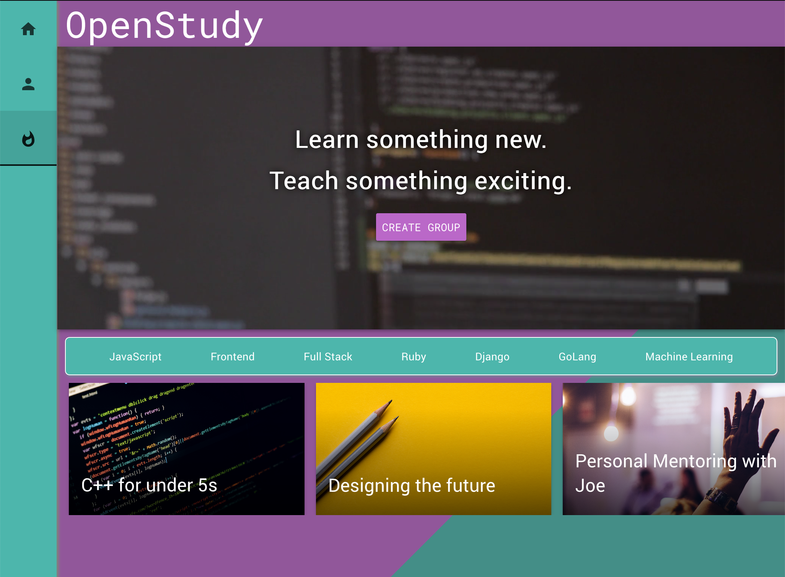

import { Invert } from 'mdx-deck/layouts';
import { Split } from 'mdx-deck/layouts';
import { Appear } from 'mdx-deck';

export { future as theme } from 'mdx-deck/themes';

export default Invert;

# OpenStudy

This presentation is brought to you by [MDX-Deck](https://github.com/jxnblk/mdx-deck)

---

export default Split;

> _A website where people can share knowledge of technical skills_

---

export default Invert;

## User Profiles

---

export default Split;

### Browse popular topics and groups

---

export default Invert;

# Stack

<ul>
    <li>JavaScript</li>
    <li>VueJS</li>
    <li>NodeJS + Express</li>
    <li>Postgres</li>
</ul>

---

# _Fin_
